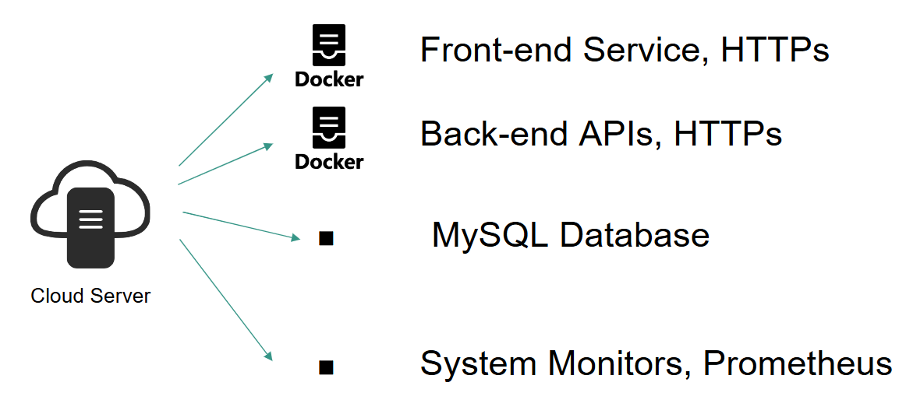
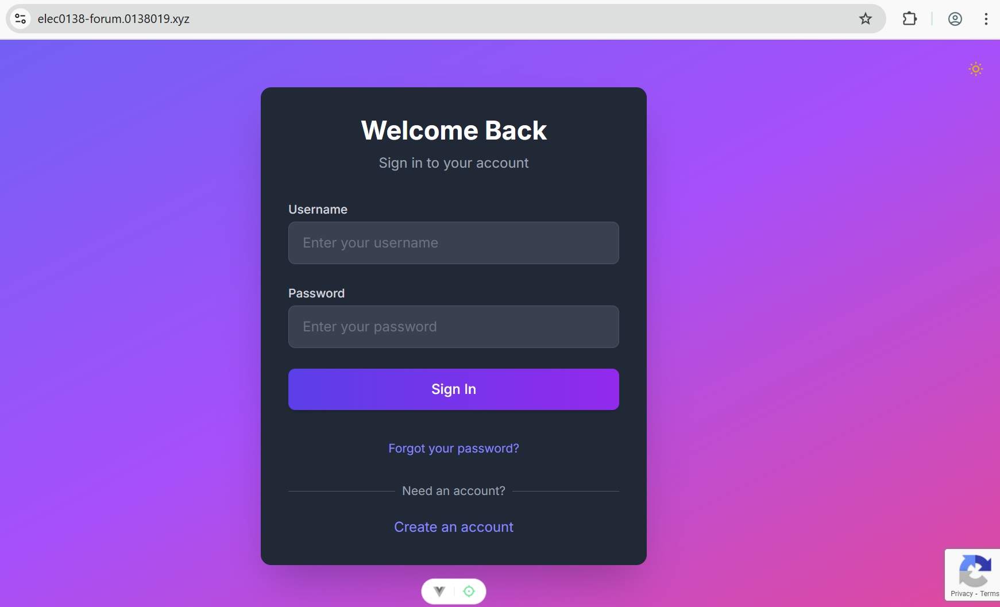
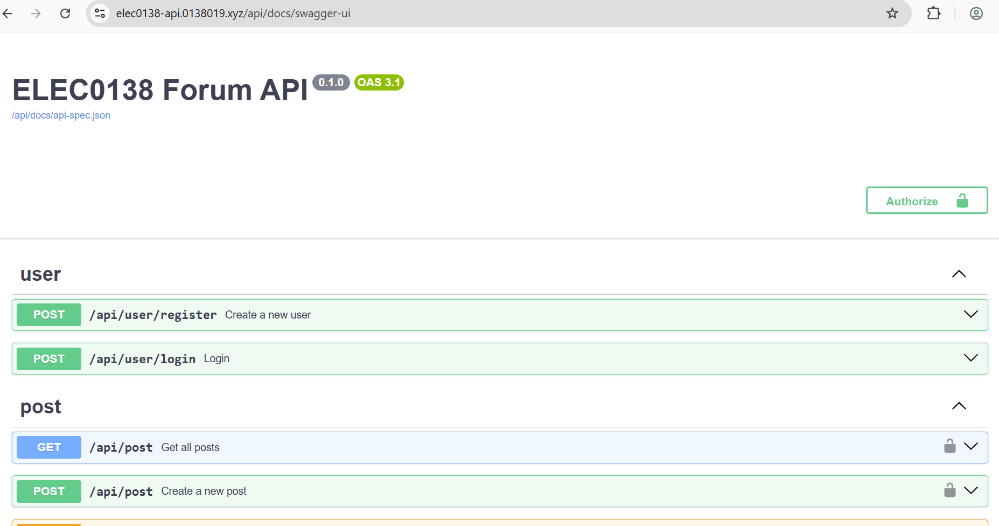

# Group 19: Security System For A Social Media Startup Infrastructure

This is **Group 19**'s final assignment for the module **ELEC0138: Security and Privacy 2024/2025**.

In this project, a social media startup "NotReddit" has been founded.
NotReddit hosts a forum server online for users to share their opinions and dicussions on various matters.

## Contents

- [ELEC0138\_GROUP\_19](#elec0138_group_h)
  - [Group Members](#group-member)
  - [Business Infrastructure](#business-infrastructure)
  - [Contents](#contents)
  <!-- - [Prerequisites](#prerequisites)
  - [Environment Setup](#environment-setup)
    - [Backend](#backend)
    - [Frontend](#frontend)
    - [Database](#database) -->
  - [Features](#features)
    - [Attacks](#attacks)
    - [Mitigations](#mitigations)

## Group Members

* Mohammed Zweiri `18041534`
* Arthur Wang `23143115`
* Teii Ri `23049710`
* Vladislav Popeta `210883234`

## Business Infrastructure
The business has the following structure:

* There is a cloud server which hosts various sub-systems using `CloudFlareJS`
* The first sub-system is the website `VueJs` frontend, which includes the user and data interaction. This is operated within a docker container.
* The second sub-system is the website `Flask` backend, which performs data processing and authentication. This is operated within a docker container.
* The third sub-system is the `MySQL` database, which stores information regarding users and posts in the forum.
* The fourth and final sub-system is the `Grafana` dasboard monitoring for network traffic monitor.

## Contents

* The forum can be accessed live online using the https://elec0138-forum.0138019.xyz/

* Whilst the swagger api documentation can be found in https://elec0138-api.0138019.xyz/api/docs/swagger-ui

* Important note: Whilst the the frontend and backend servers are live. If anyone wishes to set up their own, the guidance are in the readme files in the backend and frontend folders

## Features

### Attacks

| Attack Type                           | Description                                                                                         |
|:-------------------------------------:|:---------------------------------------------------------------------------------------------------:|
| **Phishing/Domain Spoofing**          | Phishing email sent with a fake url close to the real link to trick the user to put the credentials |
| **SSH Brute-force**                   | SSH brute force attack on the cloud server  |
| **SQL Injection**                     | Assess the robustness of database systems against unauthorized data manipulation or access.         |
| **DoS (Denial of Service)**           | Disrupt service availability via http floods.                                                       |
| **XSS (Cross-Site Scripting)**        | Mmalicious scripts can be injected into web pages to extract jwt tokens                             |

### Mitigations

| Attack Type                           | Defense                                                                                             |
|:-------------------------------------:|:---------------------------------------------------------------------------------------------------:|
| **Phishing/Domain Spoofing**          | AI Neural Network model to check if the url provided in the phsihing email is fake.                 |
| **SSH Brute-force**                   | Using fail2ban policy to ban IP addresses responsible for the attempts |
| **SQL Injection**                     | Assess the robustness of database systems against unauthorized data manipulation or access.         |
| **DoS (Denial of Service)**           | Showcase methods attackers use to disrupt service availability.                                     |
| **XSS (Cross-Site Scripting)**        | Input Sanitization, Output Encoding and Content Security Policy (CSP)    |

