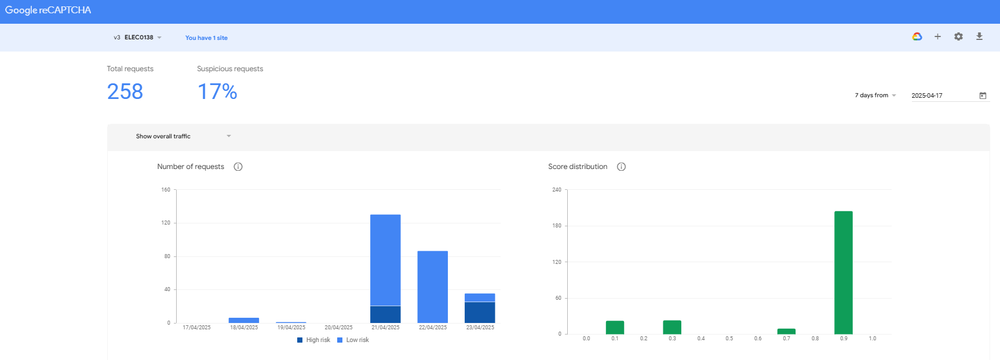

# Google reCAPTCHA-v3

reCAPTCHA-v3 is a bot detection solution that analyses user behaviour on a website and provides a risk score, ranging from 0 to 1, to indicate how likely an interaction is to be performed by a human or a bot. From this score, a website owner can determine how to handle the interaction, such as requiring additional verification or blocking the user. The process starts setting up the web server within the google recaptcha settings where the domain is provided by the business and the google provides two key; site key and secret key. The site key is implemented in the frontend to produce a recaptcha token when the user logs in, which is then checked at a backend where a function is created with connection to the google verification api to check the tokens validity using the secret key. If the recaptcha verification is successful (i.e if the risk score is high), then it will be considered a low risk and allow the user to continue to the forum. 

