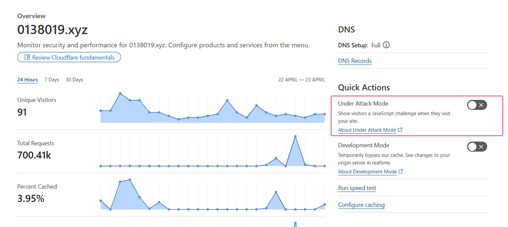

# DoS Attack
This Python script performs a controlled, DOS attack against a specified API endpoint by maintaining a constant request rate (RPS) across multiple concurrent sessions.

Features
•	Token Bucket Rate Limiting: Ensures the total requests per second (RPS) is capped at the configured rate.
•	Concurrent Sessions: Simulates multiple users (--users) with individual coroutines sending requests in parallel.
•	Metrics Reporting: Prints RPS, HTTP 2xx and 4xx counts, and error totals at regular intervals.
•	Graceful Shutdown: Listens for duration or CTRL+C to cancel tasks and clean up sessions.
Arguments
•	--url
Endpoint to target (default: https://elec0138-api.0138019.xyz/api/user/login)
•	--users
Number of concurrent sessions to simulate (default: 500)
•	--rps
Total requests per second to sustain (default: 1000)
•	--duration
Test duration in seconds (default: 600)
## Process
# Simulate 1000 RPS across 300 users for 10 minutes
python advanced_load_test.py --url https://example.com/login \  
                             --users 300 \              
                             --rps 1000 \                
                             --duration 600
How It Works
1.	TokenBucket: A simple refill algorithm that tracks tokens added at the configured rate. Each request take() consumes one token, blocking if none are available until tokens refill.
2.	user_worker: Coroutine that loops indefinitely, calls bucket.take() to pace itself, then performs an HTTP POST with a static JSON payload. Tracks request counts and status codes.
3.	metrics_reporter: Every 5 seconds, calculates the delta of total requests and prints the sustained RPS, number of successful (2xx) and client-error (4xx) responses, and any exceptions caught.
4.	run_test: Orchestrates session creation, launching users tasks plus one metrics logger, and runs for duration seconds before cancelling.

## Mitigation

Enabling the under attack mode in the cloudflare settings

More information are in https://developers.cloudflare.com/fundamentals/reference/under-attack-mode/